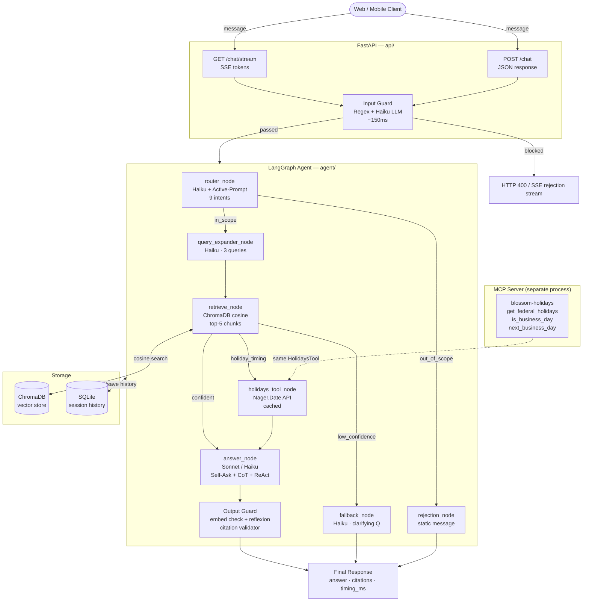

# Blossom Banking Helper — Architecture

## System Overview



## Component Map

| Component | File | Purpose |
|---|---|---|
| FastAPI app | `api/main.py` | Lifespan, CORS, router wiring |
| Chat routes | `api/routes/chat.py` | POST + SSE endpoints, input guard, structlog |
| Input Guard | `agent/guards/input_guard.py` | Regex + Haiku LLM scope/PII/jailbreak check |
| Output Guard | `agent/guards/output_guard.py` | Grounding + PII review + citation validation |
| Router node | `agent/nodes/router.py` | Intent classification with Active-Prompt |
| Query expander | `agent/nodes/router.py` | 3-query expansion for retrieval recall |
| Retrieve node | `agent/nodes/retrieve.py` | ChromaDB multi-query + metadata filter |
| Holidays node | `agent/nodes/holidays.py` | Nager.Date API, LRU cache, business-day logic |
| Answer node | `agent/nodes/answer.py` | Self-Ask + CoT + ReAct + Meta-Prompting |
| Fallback node | `agent/nodes/fallback.py` | Clarifying question on low retrieval confidence |
| Session store | `services/sessions.py` | SQLite async session + message history |
| Conversation service | `services/conversation.py` | Orchestrates graph + session persistence |
| MCP server | `mcp_server/holidays_mcp.py` | FastMCP holidays tools for external clients |
| Eval script | `scripts/eval.py` | 10-prompt eval with p95 latency + SLA check |

## Prompting Techniques

| Technique | Where | Effect |
|---|---|---|
| **Few-Shot** | Router | Anchors edge-case classification |
| **Active-Prompt** | Router | Selects 4 most semantically similar examples at runtime |
| **Prompt Chaining** | Query expander → retriever | Improves recall via 3 expanded queries |
| **Self-Ask** | Answer node | Decomposes question into 1–3 sub-questions |
| **Chain of Thought** | Answer node | Forces reasoning trace before answer |
| **ReAct** | Answer node | Observe (chunks) → Reason (thought) → Act (answer) |
| **Meta-Prompting** | Answer node | Haiku ≥0.90 confidence, Sonnet otherwise |
| **Directional Stimulus** | Answer node | Field descriptions guide warmth and grounding |
| **Reflexion** | Output guard | Self-critique + rewrite on low confidence/similarity |

## Data Flow (SSE streaming)

```
Client → POST /chat/stream
         ↓
    Input Guard (~150ms)
         ↓ pass
    [status] "Searching knowledge base..."
         ↓
    Graph runs (~1–4s)
         ↓
    [tool_start / tool_end]  ← if holidays API called
    [citations]
    [token] [token] [token]  ← word-by-word streaming
    [done]  timing_ms included
```
